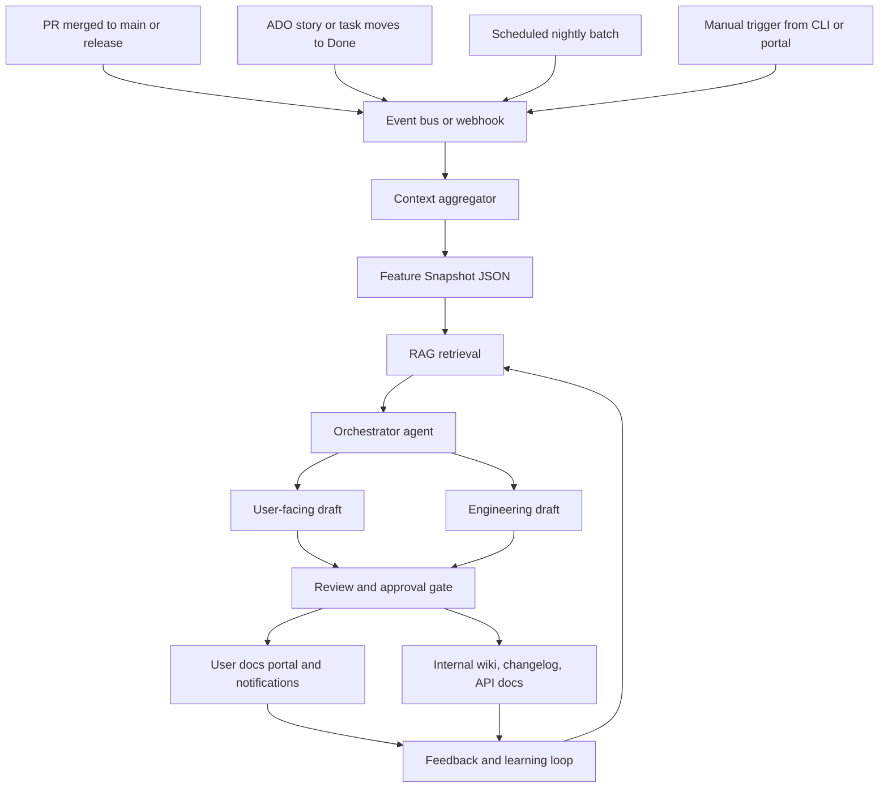

# AI-Driven Automated Document Authoring System

## Engineering Workflow Integration Architecture

This repository documents an AI-driven document authoring system that turns completed engineering work into high-quality user-facing and engineering-facing documentation.

## Overview

The system listens for engineering workflow events, gathers context from planning and source-control systems, enriches that context with retrieved documentation and standards, and routes the result through an orchestrated AI authoring workflow. Generated drafts are reviewed by humans before publication and fed back into the system to improve future outputs.

## Architecture Layers

### 1. Trigger Layer

The pipeline starts when one of the following events occurs:

- PR merged to `main` or a release branch
- Azure DevOps story or task moves to **Done**
- Scheduled nightly or batch execution
- Manual trigger from a CLI or portal

These events are normalized through an event bus or webhook layer such as Azure Service Bus or GitHub Actions webhooks.

### 2. Data Ingestion Layer

The ingestion layer builds raw feature context from three sources:

#### ADO Board Connector

- User stories
- Tasks and sub-tasks
- Acceptance criteria
- Story points
- Tags and area paths
- Sprint or iteration data

#### Git / Repo Connector

- Commit messages
- Commit diffs
- File change summaries
- Branch lineage
- Author metadata
- Timestamps

#### PR Connector

- PR title and description
- Reviewer comments
- Review decisions
- Linked work items
- Labels and milestones
- Squash or merge metadata

The **Context Aggregator** correlates story data, commits, PR data, and code changes into a single **Feature Snapshot** JSON payload.

### 3. Knowledge Base and Context Store

Before writing documentation, the system retrieves relevant context from long-term stores:

#### User Context Library

- Existing user-facing documentation
- User personas
- Glossary of user terms versus technical terms
- UX or UI patterns
- Support ticket themes

#### Engineering Standards

- API naming rules
- Architecture documents
- Coding conventions
- ADRs
- Security guidelines

#### Previous Docs Corpus

- Prior release notes
- Past feature guides
- Changelog history
- Vector-indexed semantic search data

RAG retrieval selects the top matching chunks from these stores for each feature snapshot.

### 4. AI Agent Core

The document authoring core is driven by an **Orchestrator Agent** that assembles:

- Feature Snapshot
- Retrieved user documentation context
- Retrieved engineering documentation context
- Persona-specific instructions

#### Dual Persona Routing

The orchestrator routes drafts through two writing modes:

##### User-Facing Mode

- Plain language
- Benefit-driven writing
- Minimal jargon
- Task-oriented guidance
- Focus on what the change means for the user

##### Engineering Mode

- Technical precision
- Implementation details
- API or schema changes
- Dependency impact
- Migration guidance
- Architecture decisions

#### Supporting Sub-Agents

- **Story Analyst**: extracts intent from stories and acceptance criteria
- **Code Diff Summarizer**: turns raw diffs into impact summaries
- **Tone and Style Enforcer**: aligns output to the target audience
- **Consistency Checker**: prevents conflicts with existing documentation
- **Screenshot or Diagram Generator**: produces Mermaid or PlantUML diagrams when useful

The AI layer outputs structured Markdown or JSON documentation payloads for each audience.

### 5. Review and Approval Gate

No generated documentation is published without review.

#### Automated Checks

- Spell and grammar validation
- Reading-level scoring
- Broken-link checks
- Terminology validation against glossary rules
- Duplicate-content detection

#### Human Review

- Draft PR in the docs repository
- Review by technical writers, PMs, or engineering leads
- Side-by-side diff of previous and generated content
- Inline comments that trigger section-level regeneration
- Approve, request changes, or reject actions

All human edits should be tracked as training and prompt-tuning signals.

### 6. Delivery Layer

After approval, the system publishes to the right destination for each audience.

#### User-Facing Outputs

- Help center or docs portal
- In-app tooltips or callouts
- Release note emails or in-app notifications

#### Engineering-Facing Outputs

- Internal wiki or Confluence pages
- `CHANGELOG.md` updates on the release branch
- API reference documentation from annotations or schemas
- Azure DevOps wiki pages linked back to the originating story

### 7. Feedback and Learning Loop

The system improves over time using:

- User helpfulness ratings
- Support ticket deflection signals
- Search queries with no results
- Human review edit tracking
- Draft-to-approved document pairs for prompt tuning or future fine-tuning

## End-to-End Data Flow

1. An engineering workflow event is emitted.
2. Connectors gather work item, source-control, and PR context.
3. The context aggregator builds a Feature Snapshot.
4. RAG retrieves supporting user and engineering documentation.
5. The orchestrator generates user-facing and engineering-facing drafts.
6. Automated checks and human reviewers validate the drafts.
7. Approved content is published to user and engineering channels.
8. Feedback and edits are stored to improve future generations.

## Recommended Technology Choices

| Layer | Recommended Stack |
| --- | --- |
| Orchestration | LangGraph, AutoGen, or Azure AI Agent Service |
| LLM | Claude Sonnet or Azure OpenAI GPT-4o |
| Vector DB / RAG | Azure AI Search with pgvector or Pinecone |
| Event Bus | Azure Service Bus, GitHub Actions, or ADO Pipelines |
| ADO Integration | Azure DevOps REST API and webhooks |
| Git Integration | GitHub GraphQL API v4 or ADO Git REST API |
| Docs Delivery | Mintlify, Docusaurus, or Confluence REST API |
| Review Portal | PR-based review or a thin Next.js review UI |
| Secrets and Config | Azure Key Vault |
| Observability | Azure Monitor and LangSmith |

## Key Design Decisions

### Dual Persona Architecture

The system generates distinct outputs for end users and engineers. User-facing drafts are grounded in existing user documentation so the tone and terminology stay familiar. Engineering drafts are grounded in ADRs, standards, and architectural references so they remain technically precise.

### Story-to-Code Correlation

The context aggregator is the system's linchpin. It correlates:

- Story IDs in commit messages or branch names
- Work item links in PR descriptions
- GitHub and ADO integration metadata

This keeps the authoring scope aligned to the relevant feature instead of the entire repository history.

### Human-in-the-Loop Review

Human review is mandatory to prevent inaccurate or misleading content from shipping. Reviewer edits are captured as learning signals so the system improves over time.

### RAG Before Fine-Tuning

The initial system should prioritize retrieval-augmented generation over fine-tuning. RAG is faster to launch, easier to govern, and safer for grounding outputs in trusted documentation. Fine-tuning becomes appropriate only after enough review data exists to justify it.
