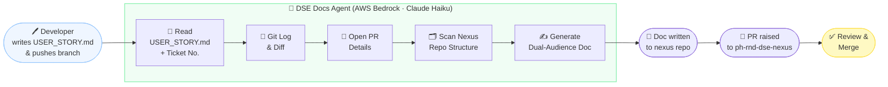

# DSE Docs Agent

AI-driven documentation authoring — automatically turns your feature branch into
user-facing docs and raises a PR to the central nexus repo.

---

## How it works



---

## Setup

### 1. Install dependencies

```bash
cd /Users/bhanupratap.rathore/dse-docs-agent
pip install -e '.[dev]'
```

### 2. Configure AWS credentials

```bash
cp .env.example .env   # then fill in your AWS credentials
```

Required env vars in `.env`:

```
AWS_REGION=us-east-1
AWS_ACCESS_KEY_ID=...
AWS_SECRET_ACCESS_KEY=...
# optional: override the model
BEDROCK_MODEL_ID=us.anthropic.claude-3-5-haiku-20241022-v1:0
```

### 3. Install the git hook into modelforge

```bash
cp hooks/post-push \
   /Users/bhanupratap.rathore/ph-rnd-dse-modelforge/.git/hooks/post-push

chmod +x \
   /Users/bhanupratap.rathore/ph-rnd-dse-modelforge/.git/hooks/post-push
```

The hook fires automatically on every `git push` from a feature branch.

---

## USER_STORY.md — the developer's input

Create this file at the **root of the modelforge repo** before (or during) your feature work:

```markdown
## Title
Add batch inference support for BYOM models

## Description
Data scientists need to submit batch inference jobs on custom BYOM models via
SageMaker Processing without modifying the core platform code.

## Acceptance Criteria
- [ ] Batch job can be submitted via the existing CLI interface
- [ ] Results are stored in S3 under the use-case prefix
- [ ] Errors surface with actionable messages, not raw stack traces
- [ ] Documentation covers both how to use it and how to configure it
```

The agent reads this on every push. Update it as your feature evolves.

---

## Running manually (CLI)

Trigger the pipeline without a push:

```bash
cd /Users/bhanupratap.rathore/dse-docs-agent

# Auto-detect branch from modelforge HEAD
python run_agent.py --repo /Users/bhanupratap.rathore/ph-rnd-dse-modelforge

# Specify branch explicitly
python run_agent.py \
  --repo   /Users/bhanupratap.rathore/ph-rnd-dse-modelforge \
  --nexus  /Users/bhanupratap.rathore/ph-rnd-dse-nexus \
  --branch feature/batch-inference
```

Watch background logs:

```bash
tail -f /tmp/dse-docs-agent.log
```

---

## Web UI

```bash
uvicorn api.main:app --reload
# open http://localhost:8000
```

Click the **📄 Nexus Docs** tab, fill in the repo paths, and click **Generate & Raise PR**.

---

## API

```bash
# Health check
curl http://localhost:8000/health

# Trigger the nexus doc pipeline
curl -X POST http://localhost:8000/run-pipeline \
  -H 'Content-Type: application/json' \
  -d '{
    "repo_path":  "/Users/bhanupratap.rathore/ph-rnd-dse-modelforge",
    "nexus_path": "/Users/bhanupratap.rathore/ph-rnd-dse-nexus",
    "branch":     "feature/batch-inference"
  }'
```

---

## Project structure

```
dse-docs-agent/
├── agents/
│   ├── doc_pipeline.py      ← NEW: single agent — reads context, writes nexus doc
│   ├── doc_agent.py         ← existing: single-file doc generation
│   ├── orchestrator.py      ← existing: 4-agent pipeline (git→ticket→docs→writer)
│   ├── git_agent.py
│   ├── ticket_agent.py
│   └── writer_agent.py
├── tools/
│   ├── story_reader.py      ← NEW: reads USER_STORY.md
│   ├── pr_reader.py         ← NEW: reads open PR via gh CLI
│   ├── nexus_writer.py      ← NEW: reads nexus tree + writes doc + raises PR
│   ├── git_diff.py          ← existing
│   ├── git_log.py           ← existing
│   ├── code_parser.py       ← existing
│   └── doc_writer.py        ← existing
├── hooks/
│   └── post-push            ← NEW: install into modelforge/.git/hooks/
├── api/
│   └── main.py              ← updated: added /run-pipeline endpoint
├── frontend/
│   └── index.html           ← updated: added Nexus Docs tab
├── run_agent.py             ← NEW: CLI entrypoint
└── pyproject.toml
```

---

## Stack

| Layer | Technology |
|-------|-----------|
| Agent framework | Strands Agents SDK |
| LLM | Claude 3.5 Haiku via AWS Bedrock |
| API | FastAPI + Uvicorn |
| GitHub integration | `gh` CLI (subprocess) |
| Python | 3.11+ |
